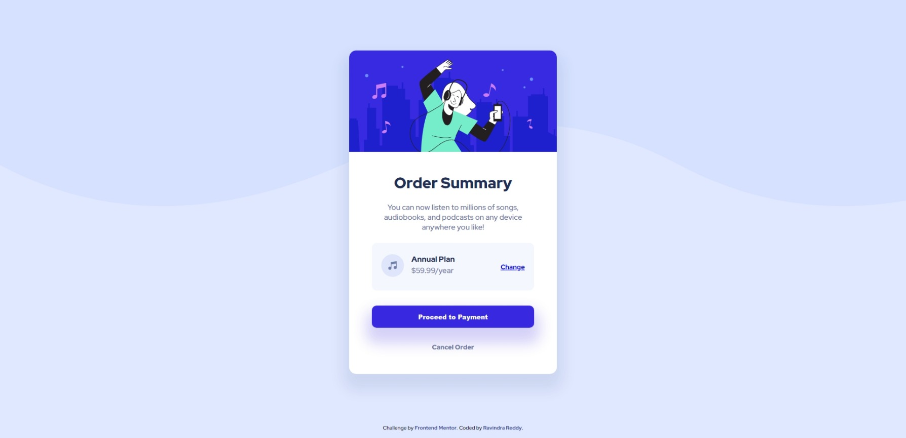
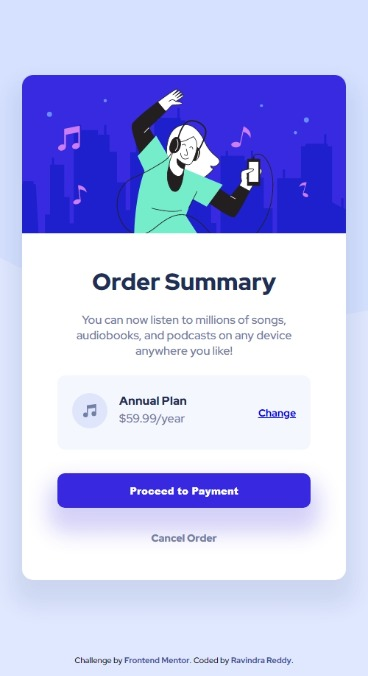

# Frontend Mentor - Order summary card solution


This is a solution to the [Order summary card challenge on Frontend Mentor](https://www.frontendmentor.io/challenges/order-summary-component-QlPmajDUj) coded by **Ravindra Reddy**. Frontend Mentor challenges help you improve your coding skills by building realistic projects.

## Table of contents

- [Overview](#overview)
  - [The challenge](#the-challenge)
  - [Screenshot](#screenshot)
  - [Links](#links)
- [My process](#my-process)
  - [Built with](#built-with)
  - [What I learned](#what-i-learned)
- [Author](#author)
- [Acknowledgments](#acknowledgments)

## Overview

### The challenge

Our Challenge is to build out this order summary card component and get it looking as close to the design as possible. we can use any tools we like to complete the challenge. 

**Your users should be able to:**

See hover states for interactive elements.

### Screenshot

1. Desktop View;



2. Mobile View;



3. Main Component with hover effect;


### Links

1. Solution URL : [GitHub Repo](https://github.com/ravindra135/FrontEndMentor-order-summary-component-main/)
2. Live Site URL : [Check Live Here](https://ravindra135.github.io/FrontEndMentor-order-summary-component-main/)

## My Process

### Built With

- HTML5
- CSS
- FLEXBOX

### What I learned

**Flexbox**

```css
display: flex;
flex-direction: column;
```

All display types are flexbox, 
1. body - which contains two sections, 
 - main-component,
 - footer atribution;

2. Inside Main Component, you will have two section,
 - image container,
 - content container,

3. Inside Content Container, three sections -
 - Heading
 - Card Component
 - Buttons

4. Inside Card component, we have three elements, one icon, two texts, and a link; so what we did is:

```css
.con-card {
    background-color: hsl(225, 100%, 98%);
    display: flex;
    align-items: center;
    justify-content: space-evenly;
    padding: 24px 3px;
    border-radius: 11px;
    gap: 5rem;
    margin-top: 1rem;
}
```

using display as flex, and justidy-content atribute will help us, have space between elements, between them evenly.

5. Next Comes the Buttons Section, width set to 100%.

6. As, a part of the main challenge, elements like, link inside the card, the jumbo button and the cancel order link have **hover** effects. Have a Look:

**Please refer to the, styles.css for css.**

## Author

- Frontend Mentor - [@ravindra135](https://www.frontendmentor.io/profile/ravindra135)
- Github - [@ravindra135](https://github.com/ravindra135/)
- Instagram - [@ravindra_since2k](https://www.instagram.com/ravindra_since2k/)


## Acknowledgments

I would really thank you [KEVIN POWELL](https://www.youtube.com/kepowob), for his wonderfull suggestion on giving a shot to Frontend Mentor. I think it worked for me. As, being a Backend Developer I wanted to go for Full-Stack so, I really need a strong hold on Advanced CSS. Frontend Mentor is really good to have a  realtime practice session on-the-go.